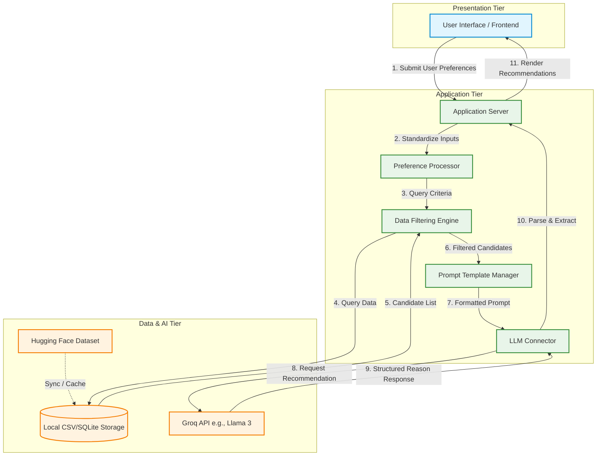

# 🏗️ System Architecture: AI-Powered Restaurant Recommender (Zomato Use Case)

This document describes the high-level system architecture, component design, data flow, and key technical decisions for the Zomato-inspired AI Restaurant Recommendation System, developed from the context established in [context.md](file:///c:/Users/Rudrankar%20Raha/Documents/NextLeap%20-%20Product%20Management/Zomato%20Project/context.md).

---

## 1. High-Level System Architecture

The system follows a classic **Three-Tier Architecture** tailored for AI/LLM integration:



---

## 2. Component Specifications

### A. Data Ingestion & Storage Component
*   **Source Database:** [Hugging Face Zomato Dataset](https://huggingface.co/datasets/ManikaSaini/zomato-restaurant-recommendation)
*   **Ingestion Strategy:** A startup script downloads the dataset in CSV format and caches it locally to avoid network bottlenecks during recommendation runs.
*   **Storage Provider:** 
    *   *Option A (Prototyping):* In-memory **Pandas DataFrame** for quick queries.
    *   *Option B (Scalability):* **SQLite Database** file loaded from the CSV, allowing relational queries using SQL.

### B. Input Processing & Filtering Engine
*   **Budget Category Mapper:** Maps categorical user budgets to numeric ranges based on the dataset's `approx_cost(for two people)` column:
    *   🟢 **Low Budget:** $\le$ 400 INR
    *   🟡 **Medium Budget:** 401 - 1000 INR
    *   🔴 **High Budget:** $>$ 1000 INR
*   **Location Matcher:** Performs case-insensitive matching on location fields (e.g., "Indiranagar", "Koramangala").
*   **Cuisine Matcher:** Evaluates substring matches against list of cuisines (e.g., if a user selects "Italian", it checks if "Italian" is included in the comma-separated cuisine string).
*   **Candidate Pool Limit:** Restricts the matching results sent to the LLM to the **Top 5-10 restaurants** (sorted by rating descending) to control prompt size and keep token costs low.

### C. Prompt Engineering & LLM Integration Layer
*   **Context Serialization:** Formats the filtered candidate pool into a clean markdown table or structured JSON string representation inside the prompt.
*   **System Instructions:** Restricts the LLM to only recommend restaurants from the provided list, preventing hallucinations.
*   **Structured Outputs:** Instructs the LLM to reply in a strict parser-friendly format (e.g., structured JSON) containing the fields required by the UI.

#### Draft Prompt Template
```text
System: You are an expert culinary assistant representing Zomato.
Given the user's specific context, rank the top 3 recommendations from the Candidate List below.
Do not hallucinate restaurants not present in the list.

User Preferences:
- Location: {user_location}
- Cuisine: {user_cuisine}
- Budget Level: {user_budget}
- Additional Constraints: {user_extra}

Candidate List:
{candidate_table_markdown}

Provide the recommendations in JSON format:
[
  {{
    "name": "Restaurant Name",
    "cuisine": "Cuisines",
    "rating": 4.5,
    "cost": 600,
    "explanation": "Brief explanation mapping the user's preferences to this choice."
  }}
]
```

### D. Presentation Layer (Frontend UI)
*   **Technology Option:** **Streamlit** (Python-based dashboard) or **React** (Modern web application).
*   **Input Controls:** Dropdown menus for cities, multi-select for cuisines, radio buttons for budget levels, and a text input box for "additional comments" (e.g., "outdoor seating", "romantic vibe").
*   **Output Render:** Clean cards displaying restaurant details, badges for cuisines and ratings, and a dedicated text section for the AI-generated personalized rationale.

---

## 3. Step-by-Step Data Flow

1.  **User Submission:** The user fills in preferences (Location: Bangalore, Cuisine: Italian, Budget: Medium, Additional: "rooftop seating") and clicks *Submit*.
2.  **Dataset Filtering:** The backend queries the SQLite/Pandas data layer:
    ```sql
    SELECT * FROM restaurants 
    WHERE location LIKE '%Bangalore%' 
      AND cuisines LIKE '%Italian%' 
      AND cost BETWEEN 401 AND 1000 
      AND rating >= 3.5 
    ORDER BY rating DESC 
    LIMIT 10;
    ```
3.  **Prompt Assembly:** The backend inserts the matching list of restaurants and the user's additional comments ("rooftop seating") into the prompt template.
4.  **LLM Call (Groq API):** The prompt is sent to the Groq API (e.g., using `llama-3.1-70b-versatile` or `mixtral-8x7b-32768`). The LLM evaluates the candidates, searches their reviews/attributes for "rooftop" using high-speed inference, and determines the best fits.
5.  **Output Parsing & Display:** The backend parses the LLM's JSON response and renders it into neat recommendation cards on the client interface.

---

## 4. Technical Stack Recommendation

| Layer | Recommended Technology | Rationale |
| :--- | :--- | :--- |
| **Frontend UI** | Python Streamlit / HTML+CSS | Rapid prototyping, clean design controls, native Python integration. |
| **Backend Framework** | Python FastAPI / Node.js | Asynchronous processing, native typing support, robust routing. |
| **Database** | SQLite / Pandas DataFrame | Embedded database, zero-configuration setup, fast read/write. |
| **LLM SDK** | Groq SDK (Python) or LangChain | Ultra-fast inference via Groq, support for structured JSON mode outputs. |
