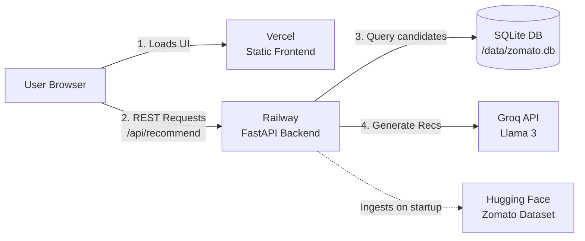

# 🚀 Zomato AI Restaurant Recommender - Deployment Plan

This document provides a step-by-step guide to deploying the **Zomato AI Restaurant Recommender** application. We will deploy the **FastAPI backend** on **Railway** (suitable for Python runtimes, SQLite databases, and background tasks) and the **static HTML/JS/CSS frontend** on **Vercel** (optimized for fast global static hosting).

---

## 🏗️ Deployment Architecture



---

## 1. Backend Deployment on Railway

Railway is a cloud platform that allows you to provision infrastructure, build, and deploy applications directly from GitHub.

### Step 1.1: Prepare Code Repository
Ensure your GitHub repository has the following directory structure:
```text
├── data/                    # Will be populated with zomato.db on startup
├── src/
│   ├── database.py
│   ├── ingest.py            # Ingests dataset and creates zomato.db
│   ├── main.py              # FastAPI Application
│   └── recommender.py
├── requirements.txt         # Lists python dependencies
└── .gitignore               # Ignores local SQLite DB and environment files
```

### Step 1.2: Create and Configure Railway Service
1. Go to [Railway.app](https://railway.app/) and sign in.
2. Click **New Project** -> **Deploy from GitHub repo** and select your repository.
3. Once the deployment initializes, click on the **Service** in the Railway canvas dashboard.

### Step 1.3: Configure Startup Command
Our backend code dynamically checks for the presence of the SQLite database (`data/zomato.db`) on startup. If it is missing (as it will be on your first deployment), it automatically downloads and ingests the dataset. Therefore, the startup command is extremely simple:

1. In Railway, if you use the provided `Procfile`, it will configure the start command automatically.
2. Otherwise, if setting manually in the Railway **Settings** tab (under **Start Command**), set it to:
   ```bash
   uvicorn src.main:app --host 0.0.0.0 --port $PORT
   ```

### Step 1.4: Configure Environment Variables
1. Go to the **Variables** tab of your Railway service.
2. Add the following environment variable:
   * **`GROQ_API_KEY`**: Your Groq API credentials (e.g., `gsk_...`). 
   *(If not provided, the backend fallback mechanism will run recommendations in Mock mode).*
3. Railway will trigger a redeploy automatically.

### Step 1.5: Generate Public Domain
1. In the **Settings** tab, scroll down to the **Networking** section.
2. Click **Generate Domain** (or set up a custom domain).
3. Copy the generated URL (e.g., `https://zomato-project-production.up.railway.app`). This is your **Backend API URL**.

---

## 2. Connect Frontend to Backend

Before deploying the frontend on Vercel, we need to instruct the browser application to send API calls to the newly deployed Railway backend instead of `localhost`.

### Step 2.1: Update `frontend/app.js`
Open [frontend/app.js](file:///c:/Users/Rudrankar%20Raha/Documents/NextLeap%20-%20Product%20Management/Zomato%20Project/frontend/app.js) and locate the `API_BASE` configuration near the top of the file:

```javascript
// API base URL configuration (empty for relative paths when unified)
const API_BASE = "";
```

Update it to dynamically detect whether you are running locally or in production. Replace it with the following snippet:

```javascript
// Dynamic API URL detection: Fallback to Railway in production
const API_BASE = window.location.hostname === "localhost" || window.location.hostname === "127.0.0.1" 
    ? "" 
    : "https://zomato-project-production.up.railway.app"; // ⚠️ REPLACE with your Railway domain
```

This prevents breaking local offline testing (`npm run dev` or double-clicking `index.html` locally) while ensuring the Vercel-deployed frontend seamlessly communicates with Railway.

---

## 3. Frontend Deployment on Vercel

Vercel is the premier platform for static web applications and assets.

### Step 3.1: Import Project to Vercel
1. Go to [Vercel](https://vercel.com/) and sign in.
2. Click **Add New** -> **Project**.
3. Import the same GitHub repository.

### Step 3.2: Configure Build and Development Settings
1. Expand the **Build and Development Settings** dropdown.
2. **Framework Preset**: Select **Other** (since this is a vanilla HTML/CSS/JS site).
3. **Root Directory**: Click *Edit* and select the `frontend` folder (this tells Vercel to only host the static assets inside `frontend/` and ignore the backend files).
4. **Build Command**: Leave empty (no build step is required for vanilla files).
5. **Output Directory**: Leave default (defaults to public/current directory relative to root).

### Step 3.3: Deploy
1. Click **Deploy**.
2. Once complete, Vercel will provide you with a production URL (e.g., `https://zomato-recommender-frontend.vercel.app`).

---

## 4. Testing & Verification

Once both platforms are deployed, execute the following checks to ensure everything works properly.

### Verification Step 1: Health & DB Status
Visit the backend's public health endpoint in your browser:
`https://your-backend-railway-url.railway.app/api/health`

**Expected response:**
```json
{
  "status": "healthy",
  "database_exists": true,
  "groq_configured": true,
  "message": "API server running with Groq LLM integration."
}
```

### Verification Step 2: UI Connection
1. Load your Vercel frontend URL.
2. Ensure the top status badge says **"Connected"** (or shows a green status light) indicating that `app.js` successfully pinged `API_BASE/api/health`.
3. Try fetching recommendations. Select a location, cuisine, rating threshold, and submit the search.
4. Verify that AI recommendations display with custom descriptions.

---

## 🛠️ Troubleshooting

| Issue | Cause | Fix |
| :--- | :--- | :--- |
| **Frontend fails to load data (Locations/Cuisines are empty)** | The `API_BASE` in `frontend/app.js` is still empty or pointing to the wrong domain. | Check the browser dev console (F12) network tab. Verify that the URL requested is `https://your-railway-domain.app/api/locations`. Update `API_BASE` and redeploy. |
| **API calls block with "CORS Error"** | The FastAPI backend doesn't allow cross-origin requests. | Ensure `CORSMiddleware` in [src/main.py](file:///c:/Users/Rudrankar%20Raha/Documents/NextLeap%20-%20Product%20Management/Zomato%20Project/src/main.py) is properly configured with `allow_origins=["*"]`. |
| **Health Check shows `"groq_configured": false`** | `GROQ_API_KEY` was not configured in Railway's variables, or has typos. | Re-check the Variables tab in Railway, paste the API key, and click deploy. |
| **Railway deployment fails or crashes on startup** | The startup command is incorrect or Python packages are missing. | Verify your Railway start command is exactly: `uvicorn src.main:app --host 0.0.0.0 --port $PORT`. Check Railway logs to see which package failed to import. |
| **Slow startup time on Railway** | Downloading the dataset on startup is taking too long. | This is expected on the first container boot, but subsequent restarts might download faster due to cache. For faster startup, you can pre-package the `data/zomato.db` in your git commit (though not recommended for massive files). |
